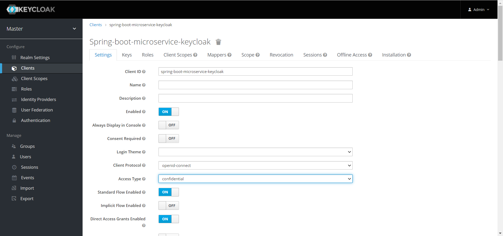
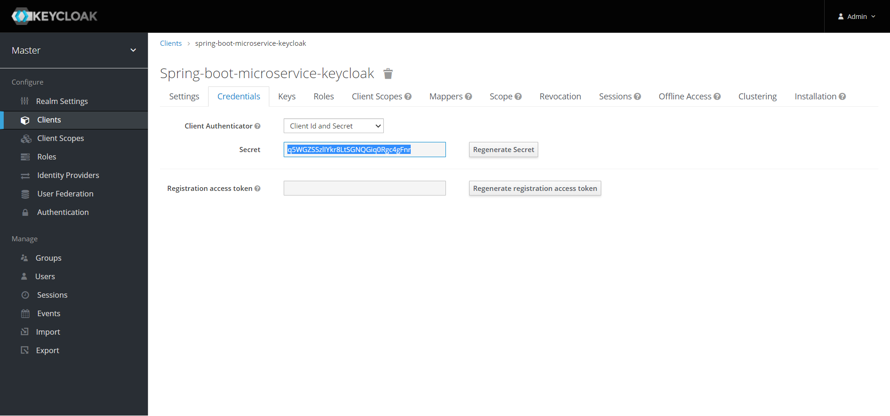
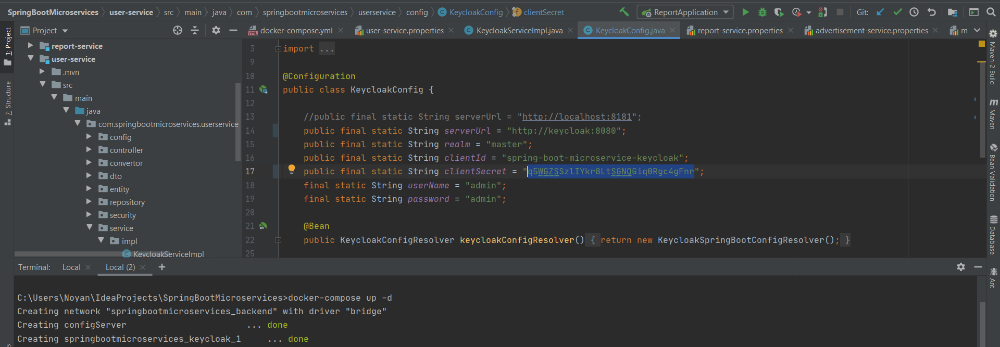
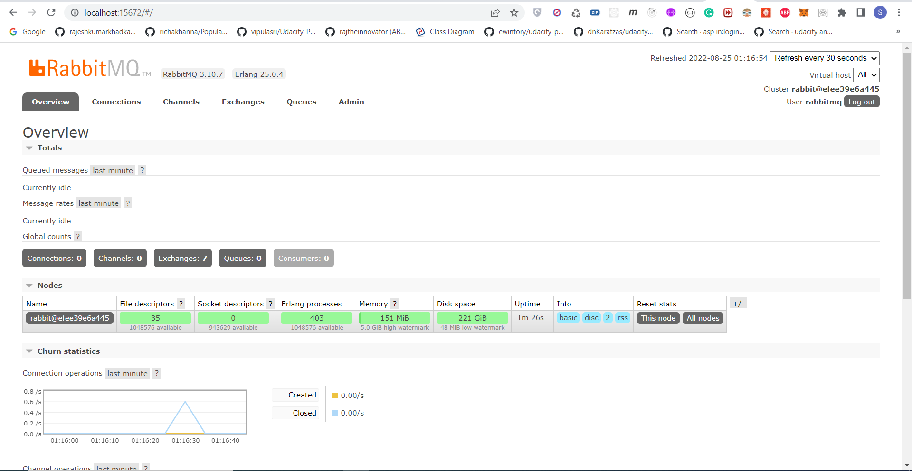
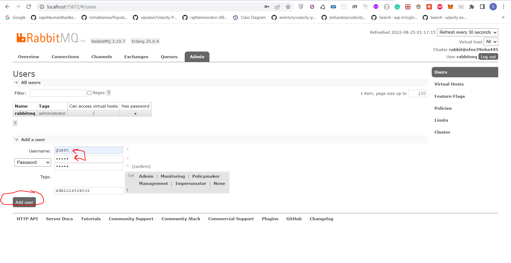
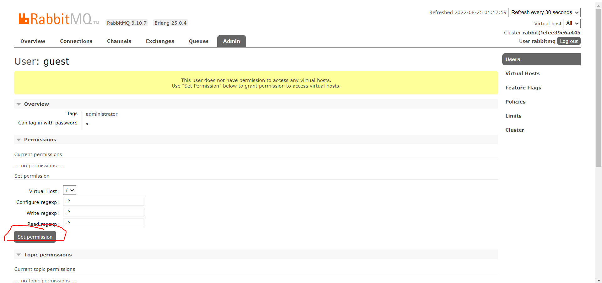
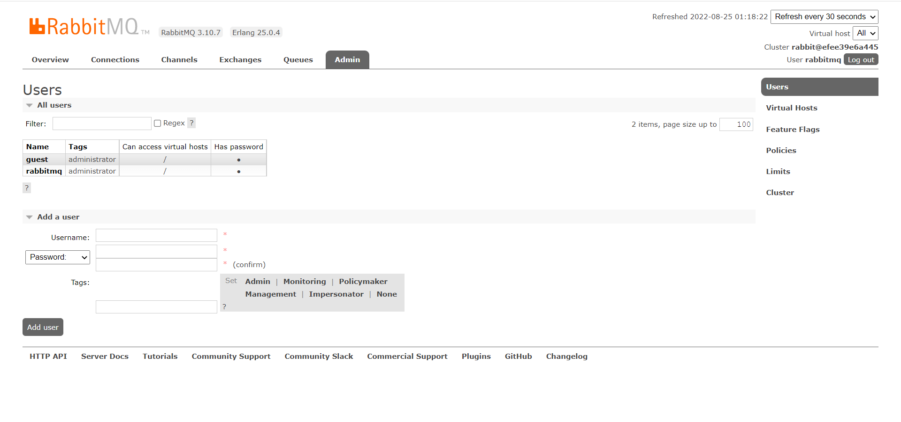

# Spring Boot Microservice Example(Eureka Server, Config Server, API Gateway, Services , RabbitMq, Keycloak)


# Sobre o projeto
<ul style="list-style-type:disc">
    <li>O usuário pode se registrar e fazer login através do Keycloak</li>
   <li>O usuário pode se registrar e fazer login através do Keycloak</li>
   <li>O administrador pode criar, atualizar, excluir anúncios e obter anúncios por seu é e obter todos os anúncios do serviço de gerenciamento para o serviço de anúncio por meio do API Gateway</li>
   <li>O administrador pode aprovar e rejeitar o anúncio do serviço de anúncio para o serviço de relatório usando o serviço de gerenciamento por meio do API Gateway</li>
   <li>O usuário pode obter o anúncio pelo seu é e obter todos os anúncios do serviço de gerenciamento para o serviço de anúncio por meio do API Gateway</li>
   <li>A contagem de visualizações do anúncio aprovado aumenta quando o usuário tenta mostrá-lo</li>
</ul>

7 serviços cujos nomes são mostrados abaixo foram concebidos no âmbito deste projeto.

- Config Server
- Eureka Server
- API Gateway
- User Service
- Management Service
- Advertisement Service
- Report Service

### 🔨 Run the App

<b>Docker</b>

<b>1 )</b> Install <b>Docker Desktop</b>. Here is the installation <b>link</b> : https://docs.docker.com/docker-for-windows/install/

<b>2 )</b> Open <b>Terminal</b> under <b>resources</b> folder to run <b>Keycloak</b> and <b>RabbitMq</b> on <b>Docker</b> Container
```
    docker-compose up -d
```
<b>3 )</b> Implementar configurações do Keycloak
```
     1) Abra o Keycloak no navegador através do localhost:8181
     2) Digite o nome de usuário e senha (admin : admin)
     3) Crie o Client nomeado para spring-boot-microservice-keycloak e defina-o na configuração do Keycloak do serviço do usuário
     4) Altere o tipo de acesso do cliente de público para confidencial
     5) Obtenha a chave secreta para definir clientSecret na configuração do Keycloak do serviço do usuário
     6) Defina funções para Admin e Usuário como ROLE_ADMIN e ROLE_USER
```

<b>4 )</b> Implement Rabbitmq Settings
```
     1) Abra o Rabbitmq no navegador através de http://localhost:15672
     2) Digite o nome de usuário e a senha (rabbitmq : 123456)
     3) Abra a seção Admin na barra de navegação
     4) Defina o novo usuário chamado guest e seu nome de usuário , senha (guest : guest , role : administrator) , depois dê todas as permissões (Virtual host : "/" , regexp : ".*")```

<b>Maven></b>

<b>1 )</b> Inicie o Keycloak e o Rabbit através do Docker

<b>2 )</b> Implemente suas configurações

<b>3 )</b> Baixe seu projeto neste link `https://github.com/Rapter1990/SpringBootMicroservices`

<b>4 )</b> Vá para o diretório inicial do projeto: `cd SpringBootMicroservices`

<b>5 )</b> Crie um arquivo jar através deste comando `mvn clean install`

<b>6 )</b> Execute o projeto através deste comando `mvn spring-boot:run`


### To execute the API's through the gateway
    1) http://localhost:8600/api/v1/users/signup
    2) http://localhost:8600/api/v1/users/login
    3) http://localhost:8600/api/v1/users/info 
    4) http://localhost:8600/api/v1/management/admin_role/create/{user_id} 
    5) http://localhost:8600/api/v1/management/admin_role/alladvertisements
    6) http://localhost:8600/api/v1/management/admin_role/alladvertisements/{advertisement_id} 
    7) http://localhost:8600/api/v1/management/admin_role/update/{advertisement_id}
    8) http://localhost:8600/api/v1/management/admin_role/delete/{advertisement_id} 
    9) http://localhost:8600/api/v1/management/admin_role/advertisement/{advertisement_id}/approve
    10) http://localhost:8600/api/v1/management/admin_role/advertisement/{advertisement_id}/reject
    11) http://localhost:8600/api/v1/management/user_role/alladvertisements
    12) http://localhost:8600/api/v1/management/user_role/advertisement/{advertisement_id} 
    

Explore Rest APIs
<table style="width:100%">
  <tr>
      <th>Method</th>
      <th>Url</th>
      <th>Description</th>
      <th>Valid Request Body</th>
      <th>Valid Request Params</th>
      <th>Valid Request Params and Body</th>
      <th>No Request or Params</th>
  </tr>
  <tr>
      <td>POST</td>
      <td>signup</td>
      <td>Sign Up for User and Admin</td>
      <td><a href="README.md#signup">Info</a></td>
      <td></td>
      <td></td>
      <td></td>
  </tr>
  <tr>
      <td>POST</td>
      <td>login</td>
      <td>Login</td>
      <td><a href="README.md#login">Info</a></td>
      <td></td>
      <td></td>
      <td></td>
  </tr>
  <tr>
      <td>GET</td>
      <td>info</td>
      <td>Get User's Role Information (ROLE_USER or ROLE_ADMIN)</td>
      <td></td>
      <td></td>
      <td></td>
      <td><a href="README.md#info">Info</a></td>
  </tr>
  <tr>
     <td>POST</td>
     <td>create/{user_id}</td>
     <td>Create Advertisement for User</td>
     <td></td>
     <td></td>
     <td><a href="README.md#create">Info</a></td>
     <td></td>
  </tr>
  <tr>
      <td>GET</td>
      <td>alladvertisements</td>
      <td>Get all advertisements From Admin</td>
      <td></td>
      <td></td>
      <td></td>
      <td><a href="README.md#alladvertisementsFromAdmin">Info</a></td>
  </tr>
  <tr>
      <td>GET</td>
      <td>alladvertisements/{advertisement_id}</td>
      <td>Get advertisement by Id From Admin</td>
      <td></td>
      <td><a href="README.md#advertisementById">Info</a></td>
      <td></td>
      <td></td>
  </tr>
  <tr>
      <td>PUT</td>
      <td>update/{advertisement_id}</td>
      <td>Update advertisement by Id</td>
      <td></td>
      <td></td>
      <td><a href="README.md#update">Info</a></td>
      <td></td>
  </tr>
  <tr>
      <td>DELETE</td>
      <td>delete/{advertisement_id} </td>
      <td>Delete advertisement by Id</td>
      <td></td>
      <td><a href="README.md#delete">Info</a></td>
      <td></td>
      <td></td>
  </tr>
  <tr>
      <td>GET</td>
      <td>advertisement/{advertisement_id}/approve</td>
      <td>Approve advertisement By Id</td>
      <td></td>
      <td><a href="README.md#approve">Info</a></td>
      <td></td>
      <td></td>
  </tr>
  <tr>
      <td>GET</td>
      <td>advertisement/{advertisement_id}/reject</td>
      <td>Reject advertisement By Id</td>
      <td></td>
      <td><a href="README.md#reject">Info</a></td>
      <td></td>
      <td></td>
  </tr>
  <tr>
      <td>GET</td>
      <td>alladvertisements</td>
      <td>Get all advertisements From User</td>
      <td></td>
      <td></td>
      <td></td>
      <td><a href="README.md#alladvertisementsFromUser">Info</a></td>
  </tr>
  <tr>
      <td>GET</td>
      <td>alladvertisements</td>
      <td>alladvertisements/{advertisement_id}</td>
      <td></td>
      <td></td>
      <td></td>
      <td><a href="README.md#advertisementByIdFromUser">Info</a></td>
  </tr>
</table>


### Used Dependencies
* Core
  * Spring
    * Spring Boot
    * Spring Security
    * Spring Web
      * RestTemplate
    * Spring Data
      * Spring Data JPA
    * Spring Cloud
      * Spring Cloud Gateway Server
      * Spring Cloud Config Server
      * Spring Cloud Config Client
  * Netflix
    * Eureka Server
    * Eureka Client
* Database
  * Mysql
* Message Broker
  * RabbitMQ
* Security
  * Keycloak Server
  * Keycloak OAuth2
  * Keycloak REST API

## Valid Request Body

##### <a id="signup">Sign Up for User and Admin
```
    http://localhost:8600/api/v1/users/signup

    {
        "username" : "springbootmicroserviceuser",
        "password" : "user123456",
        "name" : "Micro User",
        "surname" : "User Surname",
        "phoneNumber" : "123456789",
        "email" : "springbootmicroserviceuser@user.com",
        "role" : "ROLE_USER"
    }

    http://localhost:8600/api/v1/users/signup

    {
        "username" : "springbootmicroserviceadmin",
        "password" : "admin123456",
        "name" : "Micro Admin",
        "surname" : "Admin Surname",
        "phoneNumber" : "123456789",
        "email" : "springbootmicroserviceadmin@admin.com",
        "role" : "ROLE_ADMIN"
    }
```

##### <a id="login">Login
```
    http://localhost:8600/api/v1/users/login
    Bearer Token : Access Token of User from Keycloak
    {
        "username" : "springbootmicroserviceuser",
        "password" : "user123456"
    }

    http://localhost:8600/api/v1/users/login
    Bearer Token : Access Token of Admin from Keycloak
    {
        "username" : "springbootmicroserviceadmin",
        "password" : "admin123456"
    }
```

## Valid Request Params

##### <a id="advertisementById">Get advertisement by Id From Admin
```
    http://localhost:8600/api/v1/management/admin_role/alladvertisements/{advertisement_id} 
    Bearer Token : Access Token of Admin from Keycloak
```

##### <a id="delete">Delete advertisement by Id 
```
    http://localhost:8600/api/v1/management/admin_role/delete/{advertisement_id} 
    Bearer Token : Access Token of Admin from Keycloak
```

##### <a id="approve">Approve advertisement By Id
```
    http://localhost:8600/api/v1/management/admin_role/advertisement/{advertisement_id}/approve
    Bearer Token : Access Token of Admin from Keycloak
```

##### <a id="reject">Reject advertisement By Id
```
    http://localhost:8600/api/v1/management/admin_role/advertisement/{advertisement_id}/reject
    Bearer Token : Access Token of Admin from Keycloak
```

##### <a id="advertisementByIdFromUser">Get advertisement by Id From User
```
    http://localhost:8600/api/v1/management/user_role/alladvertisements/{advertisement_id} 
    Bearer Token : Access Token of Admin from Keycloak
```

## Valid Request Params and Body

##### <a id="create">Create Advertisement for User
```
    http://localhost:8600/api/v1/management/admin_role/create/{user_id} 
    Bearer Token : Access Token from Keycloak
    {
        "title" : "Advertisement 1 for User 1",
        "price" : 200
    }
```

##### <a id="update">Create Route by City Id and Destination City Id
```
    http://localhost:8600/api/v1/management/admin_role/update/{advertisement_id}
    Bearer Token : Access Token from Keycloak 
    {
        "title" : "Advertisement 1 for User 1 Updated",
        "price" : 300
    }
```

## No Request or Params

##### <a id="info"> Get User's Role Information (ROLE_USER or ROLE_ADMIN)
```
    http://localhost:8600/api/v1/users/info
    Bearer Token : Access Token of Admin or User from Keycloak 
```

##### <a id="alladvertisementsFromAdmin"> Get all advertisements From Admin
```
    http://localhost:8600/api/v1/management/admin_role/alladvertisements
    Bearer Token : Access Token of Admin from Keycloak 
```

##### <a id="advertisementByIdFromUser"> Get all advertisements From User
```
    http://localhost:8600/api/v1/management/user_role/alladvertisements
    Bearer Token : Access Token of User from Keycloak 
```

### Screenshots

<details>
<summary>Click here to show the screenshots of project</summary>
    <p> Figure 1 </p>
    
    <p> Figure 2 </p>
    
    <p> Figure 3 </p>
    
    <p> Figure 4 </p>
    
    <p> Figure 5 </p>
    
    <p> Figure 6 </p>
    
    <p> Figure 7 </p>
    
    <p> Figure 8 </p>
    
    <p> Figure 9 </p>
    
    <p> Figure 10 </p>
    
    <p> Figure 11 </p>
    
</details>   